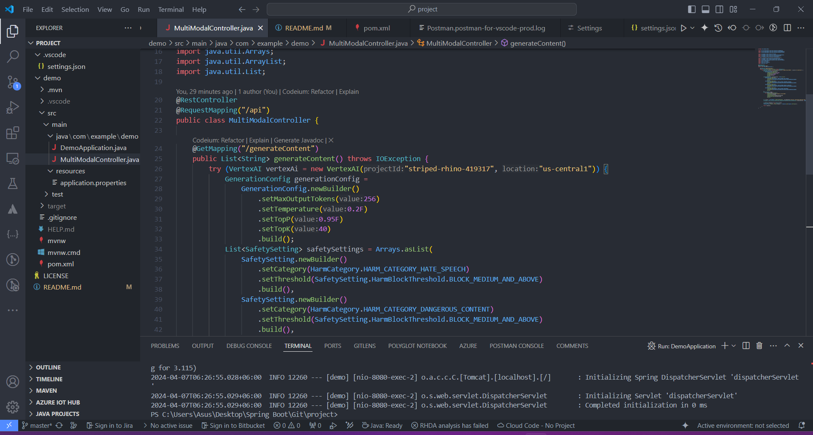
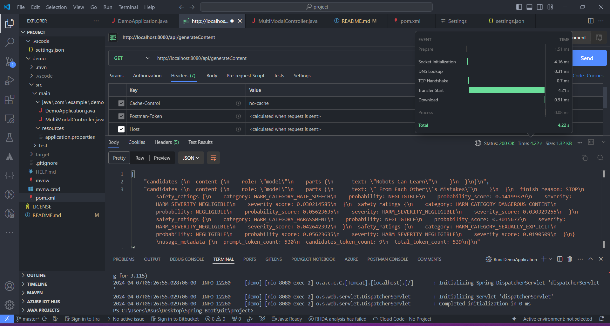

# Vertex AI Responses to API Endpoint

**Purpose:**
The purpose of this project is to develop an API for generating multi-modal content using Google Cloud Vertex AI. The API takes input text data and generates corresponding multi-modal content, which may include images, text, or other modalities.

**Project Objectives:**
- Develop a RESTful API for content generation.
- Utilize Google Cloud Vertex AI for multi-modal content generation.
- Implement safety settings to filter generated content based on specified criteria.
- Provide endpoint(s) for clients to interact with the content generation service.

**Project Components:**
- `DemoApplication.java`: Spring Boot application entry point. Initializes and runs the Spring Boot application. 
- `MultiModalController.java`: Main class responsible for generating multi-modal content. Utilizes Google Cloud Vertex AI to generate content based on input text data. REST controller class exposing endpoints for interacting with the content generation service.
- Dependencies: Google Cloud Vertex AI SDK for Java, Spring Boot, Spring Web.

**Screenshot:**

**Models Used:**
- **Generative Model:** Utilized from Google Cloud Vertex AI for generating multi-modal content.
- **Safety Settings Model:** Used to filter generated content based on specified criteria, such as hate speech, dangerous content, sexually explicit content, and harassment.

**Development Environment:**
- Java 17
- Spring Boot
- Google Cloud Vertex AI SDK
- VS Code

**Endpoints:**
- `/api/generateContent`: Reponse from multi-modal content generation can be checked on Postman using GET request.

